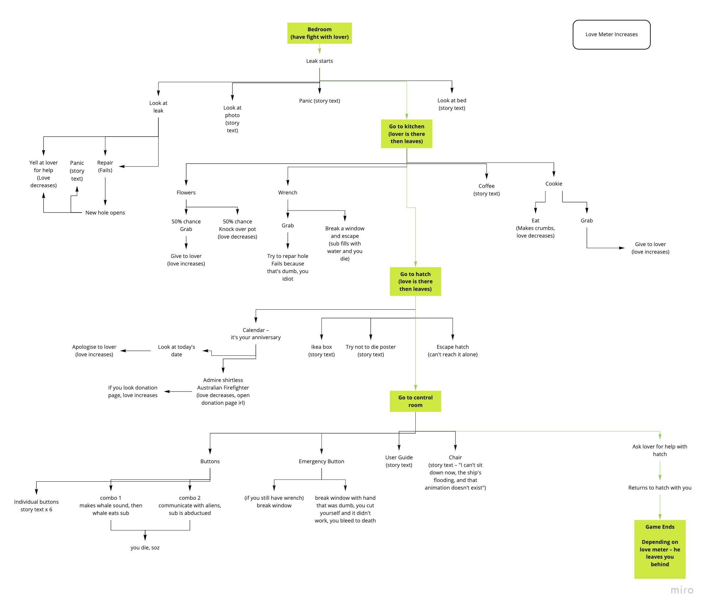

# Contributing

There are multiple ways to contribuite with this project.

## Fix bugs and general improvements

Yeah, let's be honest. We developed this game in less than 48 hours and it's full of bugs. You can contribuite with of these ones but there surely you can find more:

- The interaction with objects and events can be improved.
- The administration of events is kinda clunky.
- The second character should not be interactive until some specific events.
- Is not possible to active any winning condition!.

## Add more endings

1. Up the hatch, love meter low:
   - Moustachio climbs up the hatch... and closes it behind him.
   - _Guess he really doesn’t love you anymore._
   - _You die._

---

2. Up the hatch, love meter high:
   - Moustachio climbs up the hatch, and you scramble out after him.
   - _Escaping certain death has reminded him how much he loves you_
   - _You both live happily ever after on a tropical deserted island. Cute!_

---

3. Breaking the glass, bleeding out [**DONE**]:
   - Punching the glass was a real dumb idea.You slice your hand open and bleed to death.
   - Moustachio has to clean up the mess. So now you’re dead and single

The complete diagram with possible endings

## Add inventory

- The overall idea is create an inventory that allows to pick up items
- When the character pick up an item, this one dissapears from the map but appears in the top of the screen, on the **intentory**.
- There are some assets that are already designed for this purpose.
  - The cookie of doom! [*+100 all stats, invulnevarity in real life*]: 
  - The wrench of overwhelming power[*can repair stuff, it's made with iron that can't ben manipulated with metalbending*]: 

## Add voice clips

We recorded voice clips for the character that can be played in different actions. The voice clips were recorded thanks to the multi-faceted **Ash Guy** and the skilled **Hanna Burrows**. Markdown doesn't allow to post the audio but it can be found on `content/SoundSprite.mp3`.

| Record time | Record clip                                 |
| ----------- | ------------------------------------------- |
| 00:00       | Misc approving noise                        |
| 01:21       | Ashizada Dzonioche (Vengeance will be mine) |
| 04:06       | Doza Aminia (Greetings)                     |
| 05:21       | Doza Aminia Variant                         |
| 07:18       | Doza Aminia Variant                         |
| 09:05       | Misc grunt                                  |
| 10:09       | Nabrushoo (Let’s go)                        |
| 11:07       | Nyedee (Hurry)                              |
| 12:22       | Nyedee Variant                              |
| 13:17       | Omadee (Help)                               |
| 15:12       | Omadee Variant                              |
| 16:19       | Omadee Variant                              |
| 18:18       | Misc surprise noise                         |

The translation of the wording (thanks to the work of **Melissa David**):

| Mysterious language      | English translation                                                    |
| ------------------------ | ---------------------------------------------------------------------- |
| Apopotaba apopiapodpopod | "three podlings laughing" (expression that means "It can't be helped") |
| Apopiapodpo Aslamo       | We are all going to die!                                               |
| Gorah, viseligche!       | let's celebrate!                                                       |
| Nabrushoo!               | Let's go!                                                              |
| Dzenpo!                  | Awesome!                                                               |
| A shiza-da dzonioche!    | Vengence will be mine!                                                 |
| Doza Aminia!             | Greetings!                                                             |
| Nyedee, nyedee !         | Hurry!                                                                 |
| Omadee!                  | Help!                                                                  |
